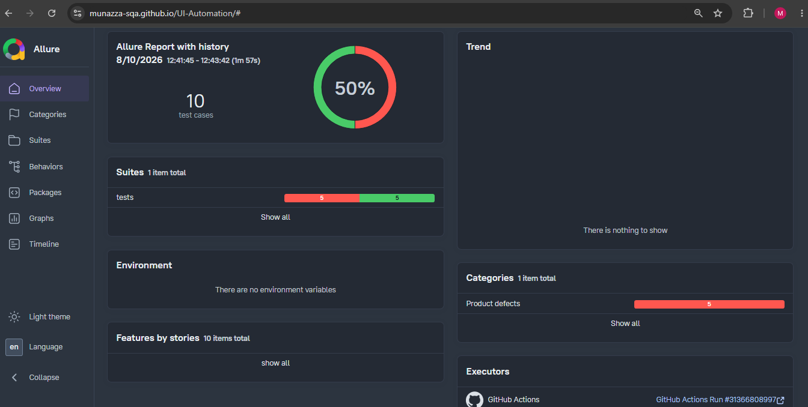

# ParaBank Test Automation Suite
This repository contains an automated functional test suite for the ParaBank workflow. The framework is built using Python, Playwright, and Pytest, implementing the Page Object Model (POM) architecture to ensure maintainable and scalable test code.

# 🛠️ Tech Stack
**Language:** Python

**Testing Framework:** Pytest

**Automation Tool:** Playwright

**Reporting:** Allure Reports

**CI/CD:** GitHub Actions

# 🚀 Key Features
**Page Object Model (POM):** Clean separation of test cases from UI locators and interactions.

**Data-Driven Testing:** Test cases are fully parameterized using external JSON datasets to validate boundaries and error handling.

**Robust Synchronization:** Bypasses transitional loading and security checks using smart element-based waits rather than hardcoded sleeps.

**CI/CD Integration:** Automated workflow runs tests on every code push, capturing runtime execution logs, videos, and screenshots.

**Interactive Reporting:** Generates comprehensive Allure reports published automatically to GitHub Pages.

# 📁 Project Structure
Playwright-Automation/ 
├── .github/workflows/  
│   └── qa-pipeline.yml             # GitHub Actions CI pipeline  
├── pages/    
│   └── form_page.py                # Page Object elements and actions  
├── testdata/  
│   └── login_data.json             # Parameterized test data  
├── tests/  
│   └── test_form.py                # Functional test cases and assertions  
├── utils/  
│   └── data_reader.py              # JSON test data parser utility  
├── conftest.py                     # Root-level Pytest fixtures and browser setup  
├── pytest.ini                      # Pytest configuration settings  
├── requirements.txt                # Project dependencies  
└── README.md                       # Project documentation  

# 🔧 Getting Started  
# 1. Prerequisites  
Ensure you have Python 3.x installed on your system.

# 2. Installation  
Clone the repository and install the required dependencies:

**Clone the project:**  
git clone https://github.com/munazza-sqa/UI-Automation.git

**Install dependencies:**  
pip install -r requirements.txt

**Install Playwright browser binaries:**   
playwright install chromium

# 🧪 Running Tests  
**Execute All Tests (Headless Mode):**  
pytest   

**Execute Tests in Headed Mode (UI Visible):**  
pytest --headed  

**Generate and View Allure Reports Locally:**  
pytest --alluredir=allure-results  

**Serve the interactive report:**  
allure serve allure-results  

# ☁️ Continuous Integration
The framework includes a fully configured .github/workflows/qa-pipeline.yml file. Upon pushing code to GitHub:  

1. An isolated test environment is initialized.

2. The Pytest suite executes in headless mode.

3. Test artifacts (automation.log, execution videos, and screenshots) are collected.

4. The latest execution results are compiled and published directly to your public portfolio via GitHub Pages.  

🌐 View Dashboard: https://munazza-sqa.github.io/UI-Automation/
